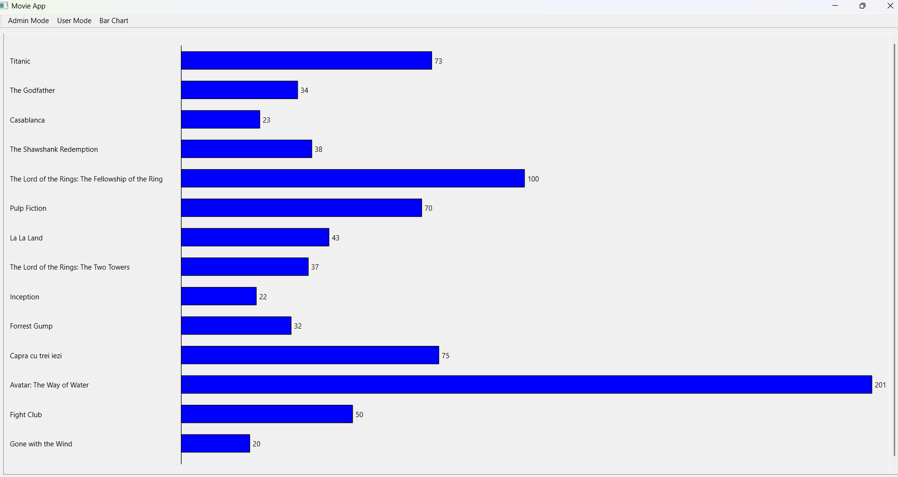

# Local Movie Management System
C++ Application that uses Qt framework for managing a local movie collection. 
The application supports administrator and user modes, offering movie management, watchlist functionality, undo/redo operations, and data visualization.

## Features

### Administrator Mode
- Add, update, and remove movies from the repository
- View all movies in the collection
- Multi-level undo/redo for add, remove, and update operations

### User Mode
- Browse movies by genre (or all movies)
- Watch trailers directly in the browser
- Add movies to a personal watchlist
- Remove movies from the watchlist and optionally like them
- View the watchlist in a table-based interface

## Bar Chart Visualization

The application includes a graphical visualization of the movie data using **QPainter**.  
The bar chart displays the number of likes per movie and updates dynamically based on user interactions.

  

